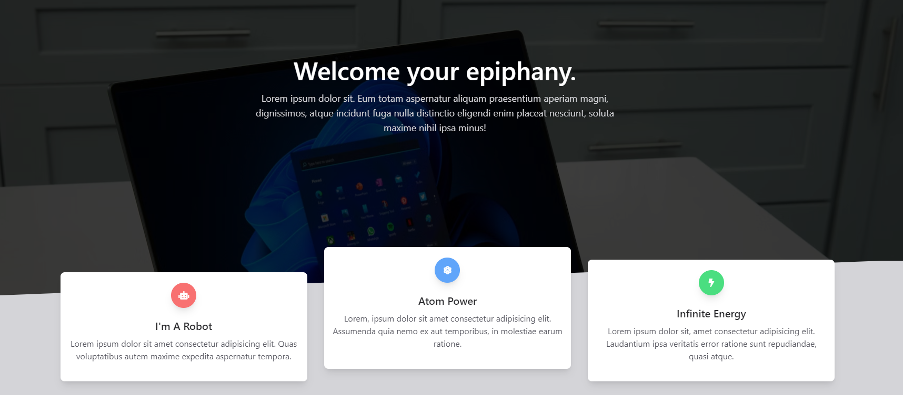

# Animated Template Clone Project

## 1. Project Description 😆

Build a clone of a Animated Template using HTML, CSS and Javascript.
This is a small project about animated template.

## 2. Tech Stack 😎

1. >HTML
2. >CSS
3. >Javascript

## 3. Installing 😉

```link
https://github.com/VoDuyThienVinh/AnimatedTemplate
```

1. Clone the repo [Animated Template](https://github.com/VoDuyThienVinh/AnimatedTemplate)
2. Open project folder
3. Explore
4. Open index.html in Visual Studio Code, using Live Server
5. Enjoy 😍

## 4. Screenshots 😂



## 5. Link Github-Page 😁

```link
https://voduythienvinh.github.io/AnimatedTemplate/
```

## 6. Information 

<https://www.creative-tim.com/learning-lab/tailwind-starter-kit/landing>

<https://web.dev/optimizing-content-efficiency-loading-third-party-javascript/#use_async_or_defer>

## Adapted From: 😉

Udemy Course: JavaScript Web Projects: 20 Projects to Build Your Portfolio
Project Name: Animated Template
Create by: Andrei Neagoie, Jacinto Wong, Zero To Mastery
Last updated 8/2022
URL: <https://www.udemy.com/course/javascript-web-projects-to-build-your-portfolio-resume/>
